Automated Fetal Brain Segmentation from 2D MRI Slices for Motion Correction
===========================================================================

This github repository contains a complete example to segment
the fetal brain in MRI and perform motion correction in a fully automatic way,
using the code from [1] and [3].

Prerequisites
-------------

In order to install a working Python environment with all the necessary packages
(numpy, scipy,cython, scikit-learn and OpenCV), it is simpler to use a
prepackaged installation such as the one provided by Continuum Analytics in
Anaconda.

http://continuum.io/downloads

Then you need to build IRTK, enabling the Python wrappers:

    git clone https://github.com/BioMedIA/IRTK.git
    cd IRTK
    mkdir build
    cd build
    cmake -D BUILD_WITH_PNG=ON -D WRAP_CYTHON=ON ..
    make -j 3

Lastly, you now need to update your PYTHONPATH:
get the full path of irtk/build/lib and add to your ~/.bashrc :

    export PYTHONPATH=full_path/irtk/build/lib:$PYTHONPATH

    
Training a model
----------------

Trained models are already provided in the "model" folder.
If you wish to train models on your own data, you need to install SimpleITK,
which can be done with the following command: 

    easy_install SimpleITK

1. Learn a vocabulary of 2D SIFT features (extracted using OpenCV) with
MiniBatchKmean from scikit-learn and taking the cluster centers:                               
``create_bow.py``

2. Train an SVM classifier on histogram of SIFT features extractede within MSER regions
(which are first filtered by size using the gestational age):                
``learn_mser.py``

Running the example
-------------------

In order to run the example, you first need to edit the script "runs.sh" so that
the variables SCRIPT_DIR and BIN_DIR point respectively to 
The example can be run with the following command: ``./run.sh -a``

It performs the following 3 steps on the dataset provided in the folder "data":

1. Brain detection

2. Brain segmentation

3. Motion correction

    Usage: ./run.sh -a

    Valid options are: -1, -2, -3, -a, -d
        -1    to run only the detection step
        -2    to run only the segmentation step
        -3    to only the motion correction step
        -a    to run all steps
        -d    for debugging

Dataset
-------

The folder "data/" contains 8 stacks of a subject at 29.7 gestational weeks.

2 coronal stacks (1-2):
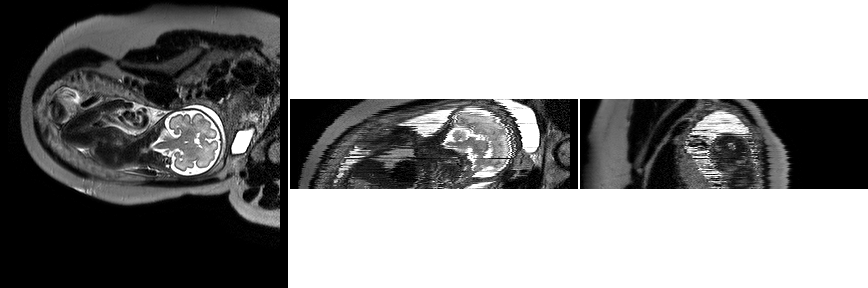
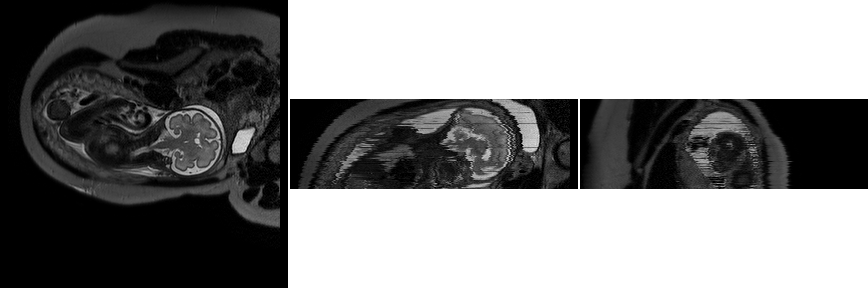

2 sagittal stacks (3-4):
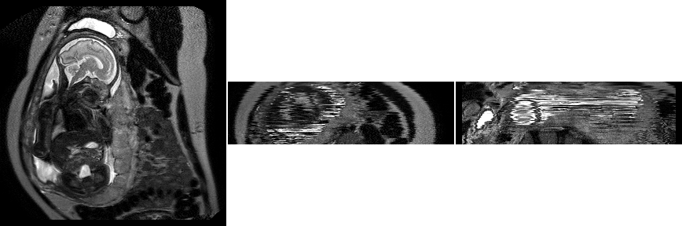
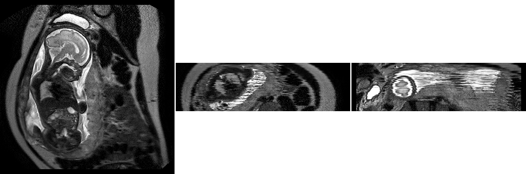

and 4 transverse stacks (5-8):

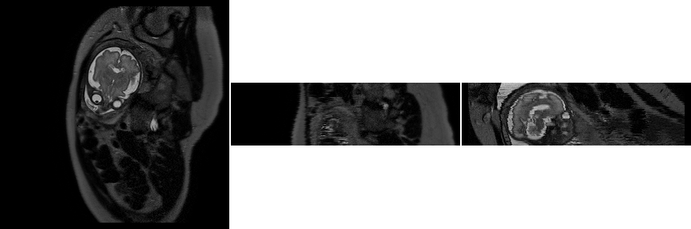

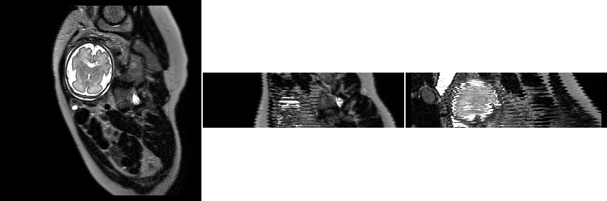
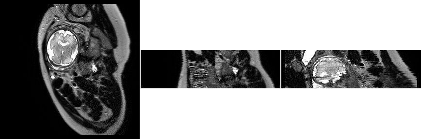

Output
------

Segmented brains:

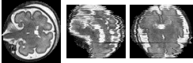
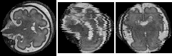
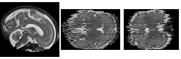
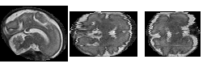
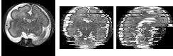

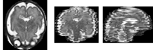
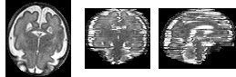

Motion corrected volume:
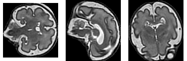

References
----------

[1] K. Keraudren, M. Kuklisova-Murgasova, V. Kyriakopoulou, C. Malamateniou,
M.A. Rutherford, B. Kainz, J.V. Hajnal, D. Rueckert, 2014. Automated Fetal Brain
Segmentation from 2D MRI Slices for Motion Correction. NeuroImage.
[pending publication]

[2] Keraudren, K., Kyriakopoulou, V., Rutherford, M., Hajnal, J., Rueckert, D.,
2013. Localisation of the Brain in Fetal MRI Using Bundled SIFT Features, in:
MICCAI, Springer.
http://www.doc.ic.ac.uk/~kpk09/publications/MICCAI-2013.pdf

[3] Kuklisova-Murgasova, M., Quaghebeur, G., Rutherford, M.A., Hajnal, J.V.,
Schnabel, J.A., 2012. Reconstruction of Fetal Brain MRI with Intensity Matching
and Complete Outlier Removal. Medical Image Analysis.             
http://www.medicalimageanalysisjournal.com/article/S1361-8415(12)00096-5/fulltext
